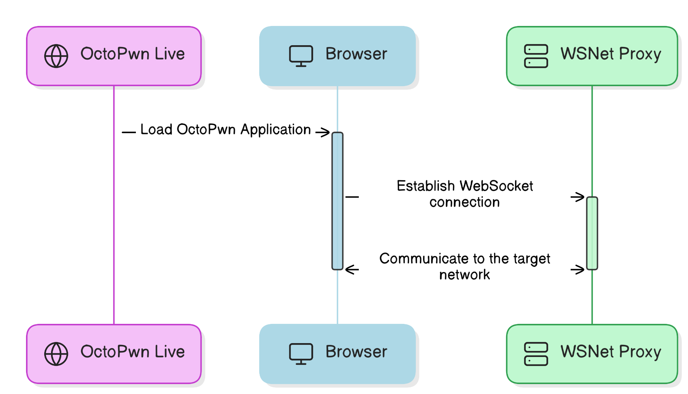

# Getting Started with OctoPwn




OctoPwn consists of two components. 

1. A web gui client [available at live.octopwn.com](https://live.octopwn.com) containing all the pentesting tools in your browser. Login with your your OctoPwn credentials or choose the free Community version.

2. A WebSocket-to-TCP translation client ([wsnet](https://github.com/octopwn/wsnet)) which will run on a host in the attack target's network. For getting started it is assumed that both will run on the same computer on Windows. You can download the client for your system as needed. 
## Getting Started

1. Go to [live.octopwn.com](https://live.octopwn.com) and log in with you OctoPwn credentials. You can sign up at [octopwn.com](https://octopwn.com). 
2. Download and execute the [wsnet](https://github.com/octopwn/wsnet) client. This will by default open the local port 8700 for communication via websockets with your host machine. If you wish, you can also host the wsnet client on a different device. 

	=== "Python (source)"
	    ```zsh
		 git clone https://github.com/octopwn/wsnet
	     cd wsnet
	     python -m venv venv
		 source venv/bin/activate
	     pip install .
	     wsnet-wsserver
		```
	=== "Python (executable)"
		 Download and execute the wsserver executable for your platform from: 
		 
	     [https://github.com/octopwn/wsnet/releases/latest](https://github.com/octopwn/wsnet/releases/latest)
	
	=== "PIP"
		```bash
		python3 -m venv venv
		source venv/bin/activate
		pip install wsnet
		wsnet-wsserver
		```

	=== "Go"
	    ```
	    https://github.com/octopwn/wsnet-go/releases/latest
		```
	=== ".NET"
	    
	    ```
	    https://github.com/octopwn/wsnet-dotnet/releases/latest
	    ```
	    
3. Go back to your browser and enter the address of your local wsnet client in the Networking section `ws://127.0.0.1:8700/` and _Launch OctoPwn_.  

	!!! info 
		If you wish to test OctoPwn features you can use our provided test network by connecting to `wss://goad.octopwn.com/demo`. 

---
### Navigating the Interface

- A detailed guide on how to navigate through OctoPwn's user interface will be provided at a later time. For getting started, add a credential and a target (e.g. the DC), then add a client, such as an SMB client. 

---
### Core Functionalities

You can find comprehensive information on core functionalities and usage here:
* [Overview of clients](https://docs.octopwn.com/plugins/overview.html): 
* 

* [Overview of scanners](https://docs.octopwn.com/plugins/scanners/index.html)

* [Overview of utilities](https://docs.octopwn.com/plugins/utils/index.html) 

* Overview of proxies and proxy chains are coming soon

---
### User Management

#### Types of Users:

- **Unregistered, Community Users:** Explore basic operations with our community edition at [live.octopwn.com](https://live.octopwn.com) without the need to register.

- **Paid Users:** Access the full suite of tools and plugins for an extensive experience. You can choose from Starter, Pro or Enterprise licenses. For a detailed feature comparison, see our website [here](https://octopwn.com/features-and-pricing).

If you have purchased multiple licenses, you can assign one unassigned license to a user by inviting them from your account page on our [website](https://octopwn.com/account/login).

1. Click on the chosen license on the "Assign license user" button you want to assign.
2. Enter the email address of the invited person.
3. The invited person will get an email shortly where they can set up an account and the license will get assigned and can be used immediately.

Please note: 

- License validity starts for the date of purchase and not the date of assignment.
- License owners can be changed in the same way every 30 days in case a colleague leaves or do not with to use the license anymore.

---

### Support and Help

If you cannot find the answer you are looking for in this documentation site, please feel free to:

1. Write us an email to support at octopwn dot com.
2. Contact us through the website at [https://octopwn.com/support](https://octopwn.com/support).
3. Ask your question on our [Discord support channel](https://discord.gg/7amw5mD37Y).

---

### Troubleshooting and FAQs

- Coming soon.
